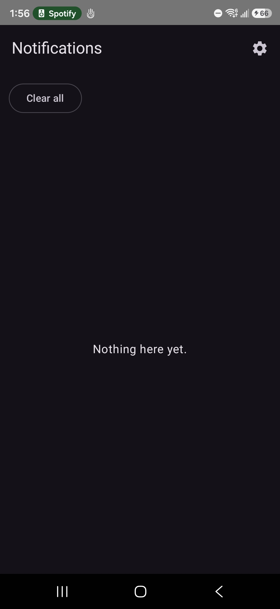
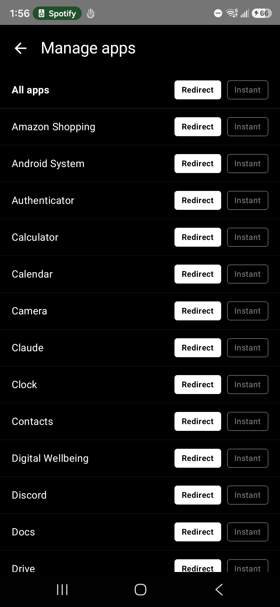
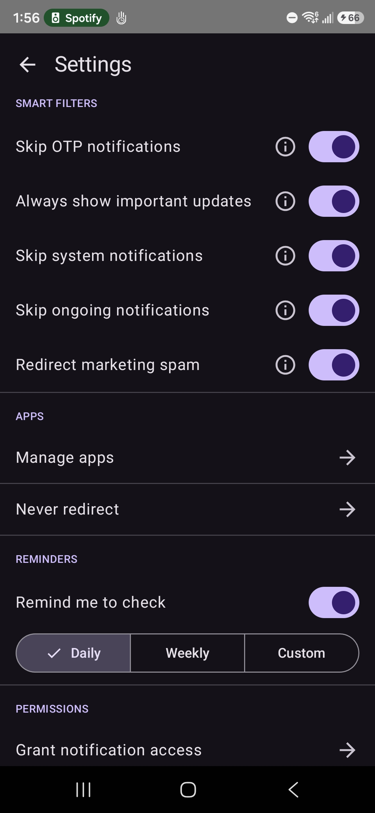

# Notif Simplifier

A minimal Android notification manager that lets you decide which apps
should stay in the notification tray and which should be redirected
into a clean in-app list.

## Screenshots

## Details

A minimal personal-use Android app that intercepts your system notifications and
lets you choose, per app, whether to redirect them into a plain in-app list or
let them through normally. Smart filters handle OTPs, ongoing media playback,
marketing spam, and time-sensitive alerts automatically.

## How it works

- `service/MyNotificationListener.kt` — a `NotificationListenerService` that
  Android calls every time any app posts a notification. It applies smart
  filters, looks up the per-app mode from a local Room database, and either
  cancels the original notification (saving it to the DB) or lets it through.
- `data/` — Room database (`AppDatabase`, `NotificationDao`, `NotificationEntity`,
  `AppSettingDao`, `AppSettingEntity`) storing captured notifications and
  per-app modes on-device only. No network calls, no external services.
- `ui/` — Jetpack Compose screens (see below).
- `MainActivity.kt` — entry point; auto-adds known authenticator apps to the
  Never Redirect list on each launch (no-op if already added) and navigates between screens.

## Screens

| Screen | Purpose |
|---|---|
| **Notification list** | Scrollable list of redirected notifications (app name, timestamp, title, text), newest first. Tap a row to deep-link into the source app. Swipe left/right to dismiss. "Clear all" button. |
| **Settings** | Global toggles: Light/Dark/System theme; smart filter switches (OTP bypass, System app filter, Ongoing filter, Important bypass, Marketing filter); reminder notifications toggle with configurable interval. Links to Manage apps, Never redirect, and system permission screens. |
| **Manage apps** | Every app that has ever sent a notification, with Redirect / Instant chip buttons per row. Bulk "All apps" row at the top. |
| **Never redirect** | Alphabetical list of all installed apps with toggle switches. Toggled apps are excluded from all processing — their notifications always pass through normally. |
| **Set filter** | Full-screen prompt shown automatically the first time a new app sends a notification. Choose Redirect or Instant. |

## Notification modes

- **Redirect** — the system notification is cancelled; its content is saved to
  the local DB and shown in the in-app list. Tap the row to open the source app.
- **Instant** — the notification passes through to the system tray normally.
- **Unset** — first-seen apps pass through until you assign a mode (the Set
  filter screen appears automatically on the next notification from that app).

## Smart filters

Filters 1–4 run before the per-app mode is checked. Filters 5–6 are applied after:

1. **Never Redirect list** — apps in this list are always passed through.
2. **OTP bypass** (default ON) — notifications that look like one-time passwords
   (keyword match + 4–8 digit number) pass through regardless of redirect mode.
3. **System app filter** (default ON) — notifications from system-flagged apps
   are ignored.
4. **Ongoing filter** (default ON) — skips persistent notifications: music
   playback (MediaStyle), progress bars, `FLAG_ONGOING_EVENT`.
5. **Important bypass** (default ON, Redirect mode only) — delivery alerts,
   financial transactions, security warnings, and travel notifications pass
   through even when the app is in Redirect mode.
6. **Marketing filter** (default OFF, Instant mode only) — promotional
   notifications (discount keywords, "limited time", etc.) are redirected to
   the in-app list instead of showing in the tray. Transactional content
   (order confirmed, refund, OTP, tracking, etc.) is never treated as marketing.

## Setup / build steps

1. Open this folder in Android Studio (File → Open → select `NotifSimplifier`).
2. Let Gradle sync (it will download the dependencies listed in
   `app/build.gradle.kts`).
3. Connect your phone via USB with USB debugging enabled, or use an emulator,
   and click Run. This installs a debug-signed APK directly — no Play Store
   account needed.
4. On first launch, tap **"Grant notification access"** in Settings, which opens
   Settings → Notification access. Find "Notif Simplifier" and enable it.
5. Notifications from other apps will now be intercepted. The Set filter screen
   appears automatically the first time each new app sends a notification.

## Notes on personal use

- `isMinifyEnabled = false` (no ProGuard/R8) — fine for your own device.
- No secrets, API keys, or network permissions are used. Everything stays
  on-device.
- The APK is signed with Android Studio's default debug key, which is fine for
  installing on your own device via USB/ADB.
- Min SDK: 26 (Android 8.0). Target SDK: 34.
